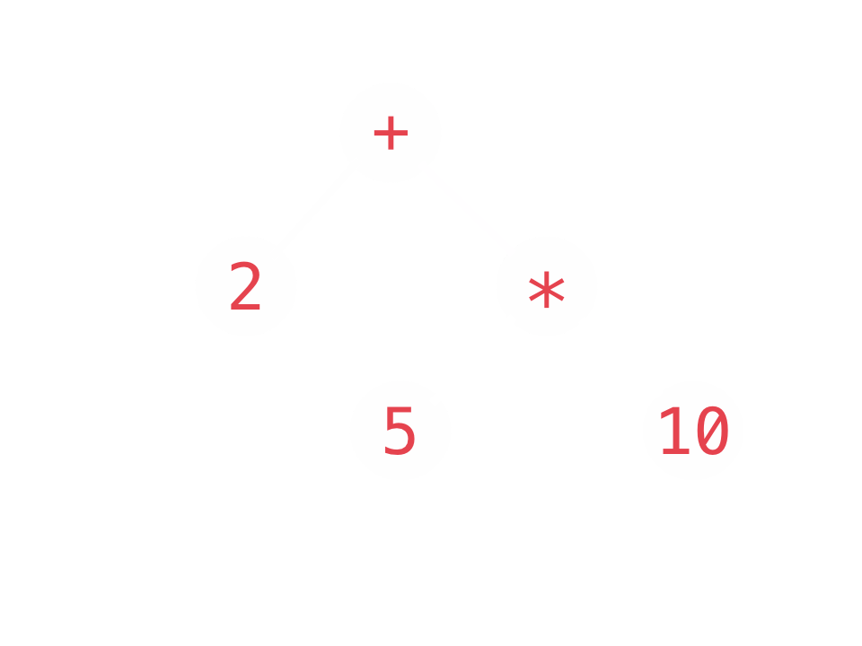

# Ruby's
#[fit] *Inner* Beauty

### Alex Burkhart - @saterus

---

# Syntax

^
- we love ruby for many reasons
- highly cited is beauty
- ruby is beautiful
- terse, expressive, flexible
- result of "programmer happiness"

---

# Syntax *vs* Semantics

^
- ideas behind the lines of code
- good ideas are really the important thing to look for in languages
- semantics are more important than syntax
- but that doesn't make syntax irrelevant

---

# Semantics *vs* Implementation

^
- all of these tricks are true
- some of these tricks will be half-truths
- but not accurate reflections of the VM implementation
- performance shortcuts

---

# Interpreted

^
- we all know ruby is interpreted
- no compile step
- write your code, run your code
- there's actually two really important steps here

---

# Parsing vs Execution

^
- both are hard problems
- the ruby parser knows how to build an AST
- the ruby vm knows how to execute the AST

---

# Parse a Line

```ruby
2 + 5 * 10

2 + (5 * 10)

(2 + (5 * 10))
```



^
- read a line of code
- tokenize characters into tokens
- apply grammar rules to token stream
- build an AST

---

# Walk the Tree

```ruby
2 + 5 * 10

2 + (5 * 10)

(2 + (5 * 10))

(2 + (50))

(2 + 50)
```


^
- traverse that tree, eval each node

---

# Evaluate the Tree

```ruby
2 + 5 * 10

2 + (5 * 10)

(2 + (5 * 10))

(2 + (50))

(2 + 50)

(52)

52
```


^
- this is cool
- lots of interesting things happen after you finish building the ast
- not what we're going to talk about today

---

# Ruby's Parser Tricks

^
- i just want to talk mostly about parsing
- ruby does a lot of work during parsing
- makes our lives better

---

# *Human* Readable Numbers

```ruby
error_prone = 1000000000

super_easy = 1_000_000_000

if error_prone != super_easy
  raise ProgrammerError.new("Looks like you made a typo!")
end
```

^
- this adds basically no complexity
- completely a parser trick
- useful for fallible humans

---

# Array Syntax

```ruby
a1 = [1,2,3]
a2 = Array.new(1,2,3)

a1 == a2 # => true
```

---

# String Syntax

```ruby
s1 = "syntactic sugar"
s2 = 'syntactic sugar'
s3 = String.new("syntactic sugar")

[s1, s2, s3].uniq.one? # => true
```

---

# Array of Words Syntax

```ruby
words1 = %w| array of strings |
words2 = ["array", "of", "strings"]

sym1 = %i( array of symbols )
sym2 = [:array, :of, :symbols]
```

---

# Escaping String Syntax

```ruby
s1 = "\"Don't forget to escape your quotes\" -Alex"
s2 = '"Don\'t forget to escape your quotes -Alex'
s3 = %Q{"Don't forget to escape your quotes" -Alex}
s4 = %q{"Don't forget to escape your quotes" -Alex}

[s1, s2, s3, s4].uniq.one? # => true
```

---

# Escaping Regexp

```ruby
r1 = /^(\/foo\/|\/bar\/)/
r2 = Regexp.new("^(/foo/|/bar/)")
r3 = %r_^(/foo/|/bar/)_ 

[r1, r2, r3].uniq.one? # => true
```

---

# Shorthand Syntax

```ruby
square = Proc.new { |x| x * x }
square.call(2) # => 4

cube = ->(y){ y * y * y }
cube.call(2) # => 8

cube.class == Proc # => true
```

---

# Hash Syntax

```ruby
h1 = { a: 10 }
h2 = { :a => 10 }

h3 = Hash.new
h3[:a] = 10

h1 == h2 == h3 # => true
```

---

# Fake Syntax

```ruby
params = { category: 'ruby' }

params[:category] # => 'ruby'
```

^
- parser sees the square brackets
- calls a method on Hash

---

# Fake Syntax

```ruby
params = { category: 'ruby' }

params[:category] # => 'ruby'

class Hash
  def [](key)
    fetch(key, nil)
  end
end
```

---

# Instance Variable Access

```ruby
class Coffee
  def initialize(size, roast)
    @size = size
    @roast = roast
  end

  def to_s
    "#{@size} cup of #{@roast} roast"
  end
end
```

```bash
pry> Coffee.new('large', 'light').to_s
=> "large cup of light roast"
```

^
- instance variable access is pretty nice

---

# Instance Variable Access

```ruby
class Coffee
  def initialize(size, roast)
    instance_variable_set(:@size, size)
    instance_variable_set(:@roast, roast)
  end

  def to_s
    size = instance_variable_get(:@size)
    roast = instance_variable_get(:@roast)
    "#{size} cup of #{roast} roast"
  end
end
```

```bash
pry> Coffee.new('large', 'light').to_s
=> "large cup of light roast"
```

^
- so that must mean that it's a parser trick
- instance variable names must start with an @ symbol

---

#[fit] `BasicObject#send`

^
- the mother of all syntax tricks!

---

# Message Passing

```ruby
cup = Coffee.new('large', 'light')

cup.to_s == cup.send(:to_s)
```

^
- totally sugar
- the only place in all of the VM that methods are directly invoked: internal_send()

---

# Message Passing w/ Args

```ruby
client = ApiClient.new

client.get('/foo', page: 2)

client.send(:get, '/foo', { page: 2 })
```

^
- pass with arguments
- hash expansion
- message passing makes metaprogramming easy

---

# *Everything* is a Message

```ruby
12 + 8

12.send(:+, 8)

operators = [:+, :-, :/]

operators.send(:<<, :*)
```

^
- even operators!
- don't forget, numbers are objects
- lets you define operators for custom classes

---

# Assignment

```ruby
class Todo
  attr_accessor :state

  def initialize(title)
    @title = title
    @state = :pending
  end


end

ruby_talk = Todo.new("Present Ruby's Inner Beauty at Codemash")
ruby_talk.state = :in_progress
```

^
- let's say i've got a todo class
- state variable
- state accessor
- let's rewrite this accessor

---

# Assignment Methods

```ruby
class Todo
  attr_reader :state

  def initialize(title)
    @title = title
    @state = :pending
  end

  def state=(state)
    @state = state
  end
end

ruby_talk = Todo.new("Present Ruby's Inner Beauty at Codemash")
ruby_talk.state = :in_progress
```

^
- attr_reader and custom setter
- works the same
- but if we squint...

---

# Assignment Methods

```ruby
class Todo
  attr_reader :state

  def initialize(title)
    @title = title
    @state = :pending
  end

  def state=(state)
    @state = state
  end
end

ruby_talk = Todo.new("Present Ruby's Inner Beauty at Codemash")
ruby_talk.state=(:in_progress)
```

^
- add some parens
- remove a little whitespace
- now it's obvious that it's a method

---

# Assignment via *Messages*

```ruby
class Todo
  attr_reader :state

  def initialize(title)
    @title = title
    @state = :pending
  end

  def state=(state)
    @state = state
  end
end

ruby_talk = Todo.new("Present Ruby's Inner Beauty at Codemash")
ruby_talk.send(:state=, :in_progress)
```

^
- rewrite these with #send

---

# Absolutely *Everything* is a Message

```ruby
class Todo
  attr_reader :state

  def initialize(title)
    @title = title
    @state = :pending
  end

  def state=(state)
    @state = state
  end
end

ruby_talk = Todo.send(:new, "Present Ruby's Inner Beauty at Codemash")
ruby_talk.send(:state=, :in_progress)
```

---

# `Class#new`

```ruby
class Class
  def new(*args)
    instance = allocate
    instance.initialize(*args)
    instance
  end

  def allocate
    Heap.malloc(self) # gross simplification
  end
end

Coffee.send(:new, 'medium', 'dark')
```

^
- instance method on the Class class
- always return the instance!
- this is a keyword in OTHER LANG

---

# `Class#new`
#[fit] is *just* a method

^
- so this fact let's us do really interesting stuff...
- now wait you say, you think i'm about to do something downright evil
- like override Class#new
- but *i* would never do that

---

# `include Celluloid`

```ruby
# Class methods added to classes which include Celluloid
module ClassMethods
  # Create a new actor
  def new(*args, &block)
    proxy = Cell.new(allocate, behavior_options, actor_options).proxy
    proxy._send_(:initialize, *args, &block)
    proxy
  end
end
```

^
- but celluloid overrides new
- returns a proxy object instead
- what!?!

---

# Async Message Passing

```ruby
class AsyncSpammer
  include Celluloid

  def deliver_spam(address)
    sleep(1)
    puts "spamming #{address.inspect}"
  end
end

worker = AsyncSpammer.new
# => #<Celluloid::CellProxy(AsyncSpammer:0x3fd351810484)>

worker.async.deliver_spam('your_email@example.com')
# => nil
# => spamming "your_email@example.com"
```

^
- intercepts messages sent to the object
- dispatches them in a ruby fiber
- still quacks like a duck!

---

# That's Pretty *Class*y

^
- still a lot of syntax in there...
- let's get rid of some of these keywords

---

# `class` Keyword

```ruby
class Todo
  def initialize(title)
    @title = title
    @state = :pending
  end

  def to_s
    "#{@state}: #{@title}"
  end
end

Todo.new('Introduce class Keyword')
```

^
- `class` keyword does quite a bit of magic
- defines a class
- and the instances methods on that class
- how does it do that?

---

# `Class::new`

^
- now we already talked about the instance method
- class method on the class Class
- returns a class

---

# `Class::new`

```ruby
Todo = Class.new(Object) do
  def to_s
    "#{@state}: #{@title}"
  end
end

Todo.send(:new, "Reveal the `new` class method on Class")
```

^
- parent class
- block is class_eval'd
- constant is just assigned
- but we forgot something...

---

# Reopening Classes

```ruby
Todo ||= Class.new(Object)

Todo.class_eval do
  def state=(state)
    instance_variable_set(@:state, state)
  end
end

t2 = Todo.send(:new, 'Reopen Todo Class')
t2.send(:state=, :in_progress)
```

^
- the class keyword also lets us reopen classes
- define new methods on existing classes
- so here we have a fully de-sugared example
- so that was one crazy keyword...

---

# What the `def`?

^
- we've removed 1 keyword, what about this next one?

---

# `def` Demystified

```ruby


class Todo
  define_method(:state=) do |new_state|
    @state = new_state
  end
end

t2 = Todo.new('Breakdown def keyword')
t2.state = :in_pieces
```

^
- define_method method on class
- name & block
- block yield method args
- returns the symbol name of the function

---

# `def` Demystified

```ruby
Todo ||= Class.new
Todo.class_eval do
  define_method :state= do |new_state|
    instance_variable_set(:@state, new_state)
  end
end

t2 = Todo.send(:new, 'Breakdown def keyword')
t2.send(:state=, :in_pieces)
```

^
- fully expanded syntax
- can't use self.define_method, private method!

---

#[fit] `attr_reader`
#[fit] `attr_writer`
#[fit] `attr_accessor`

^
- now we can revisit some of our favorite old friends
- these clean up so much code, we love em
- how do they work?

---

# A Better Method Making Machine

```ruby
Class.class_eval do
  define_method(:better_reader) do |name|
    define_method(name) do
      instance_variable_get("@#{name}")
    end
  end
end

Todo.class_eval { better_reader :title }

t = Todo.new("Reimplement attr_reader")

t.title # => "Reimplement attr_reader"
```

^
- we need a method that defines a method
- it needs to live on the Class class

---

# Practically a Money Making Machine

```ruby
Class.class_eval do
  define_method(:better_writer) do |name|
    define_method("#{name}=") do |val|
      instance_variable_set("@#{name}", val)
    end
  end
end

Todo.class_eval { better_writer :title }

t = Todo.new("Reimplement attr_writer")
t.title = "A much better writer..."
t.title # => "A much better writer..."
```

^
- super easy to adapt it to make a writer
- accessors are now an exercise for the reader
- the adventurous among you can create your hand-rolled Struct class

---

# Private Methods

```ruby
class TodoList
  def to_s
    unfinished_tasks.join("\n")
  end

  private

  def unfinished_tasks
    @todos.reject(&:completed?)
  end
end
```

^
- uh oh, another keyword!
- we know method privacy is a bit of a sham in ruby
- but what is really going on?

---

# Module Publicity

```
Module#define_method(name, &impl) => sym

Module#public(*syms)
Module#protected(*syms)
Module#private(*syms)
```

^
- remember define_method? it returns the symbol
- private takes var-args...

---

# Private Methods

```ruby
TodoList ||= Class.new

TodoList.class_eval do

  private(
    define_method(:unfinished_tasks) do
      @todos.reject(&:completed?)
    end
  )
end
```

^
- this what is really happening under the covers
- if you were paying attention...
- you can also just pass a series of symbols directly

---

# Receiverless Methods

```ruby
class MonthlyReport
  def print_as_table
    puts header
    rows.each do |row|
      puts row
    end
    puts footer
  end
end
```

^
- where does puts come from?
- we use it everywhere

---

# Kernel

```ruby
module Kernel
  def puts(strs*)
    # ...
  end
end

Object.include(Kernel)
```

^
- let's just stuff some methods into every object!
- so the receiver is still self
- bonus keyword reveal: include
- what about other seemingly receiverless calls?

---

# Local Variables
## How Do They Work?

---

# Local Variables

```ruby
class Todo
  def state=(new_state)
    previous_state = @state

    puts "Transitioning from #{previous_state} to #{new_state}"

    @state = new_state
  end
end
```

^
- local variables!
- how could these be special?

---

# `Kernel#binding`

```ruby
class Todo
  def state=(new_state)
    previous_state = @state
    binding.local_variables # => [:new_state, :previous_state]
    puts "Transitioning from #{previous_state} to #{new_state}"
    binding.eval('new_state') == new_state # => true
    @state = new_state
  end
end
```

^
- binding encapsulates execution context
- methods, blocks, classes, anything
- .local_variables requires 2.2
- #eval => eval in local context

---

# Local Variables are Syntax Shortcuts!

```ruby
class Todo
  def state=(new_state)
    @state = binding.local_variable_get(:new_state)
  end
end
```

^
- so once again, an object (Kernel) exposes a method, that tracks state, and exposes ways to interact with that state
- ~!!!~
- the syntax never stops!

---

# Removing the Syntax

```ruby
Todo.class_eval do
  define_method :state= do |new_state|
    instance_variable_set(:@state,
      binding.local_variable_get(:new_state))
  end
end
```

^
- fully desugared
- wweww
- getting pretty lispy

---

# Nearly a Lisp

```ruby
(Todo.class_eval {
  (define_method(:state=) { |new_state|
    (instance_variable_set(:@state,
      (binding.local_variable_get(:new_state))))})})
```

^
- not trying to convince you ruby is a lisp
- this just reveals our the AST that will be built
- anyway, back to binding contexts

---

# Local Context

^
- so the binding holds the local context
- and the binding changes in each local context
- and we can eval anything in the local context?

---

# Self

```ruby
class Todo
  def get_binding
    binding
  end

  def get_self
    binding.eval('self')
  end
end

t = Todo.new
t.get_binding # => #<Binding:0x007fa6a485df20>
t.get_self # => #<Todo:0x007fa6a485df20>
```

^
- once we define methods, we can expose the inner binding
- and self is correctly scoped for the local context
- how can we change that?

---

# Change Self

```ruby
Todo.class_eval do
  # self == Todo class
end

t2 = Todo.new("Change execution contexts")
t2.instance_eval do
  # self == instance of Todo
end
```

^
- call private methods within these contexts!
- acts like we are inside the object
- can we implement these?

---

#[fit] Self
## is the End?

^
- is self really is magic?
- self changes based on context you're in
- cannot assign to self! error!

---

#[fit] Self
## is ~~the End~~ Syntax Too!

^
- turns out, bindings are more useful than I first thought

---

# eval + binding => SuperMeta

```ruby
class SuperMeta

  def initialize(data)
    @data = data
  end

  def instanze_eval(str)
    eval(str, self.send(:binding))
  end
end

sm = SuperMeta.new(too_far: true)
sm.instanze_eval('puts "Too far? #{self.instance_variable_get(:@data)}"')
# => Too far? {:too_far=>true}
```

^
- Kernel#eval accepts a binding argument an evaluation context
- some weird hacks since most of these things are private
- class_eval left as an exercise for the reader (really close this)

---

#[fit] Binding
# is the End

^
- for now...
- can't figure out how to eval a block like this in MRI
- rubinius can do it
- can't new up bindings in MRI.
- that's where the magic is happening.

---

# Small Language

^
- i just talked for 30m-40m
- everything was a trick, an illusion
- message passing is the core concept

---

# Syntax *vs* Semantics

^
- i don't recommend removing all the syntax from your code
- but never get fooled by syntax tricks
- semantics are what count
- understand the semantics
- syntax makes them easier to use

---

# Elegance

^
- ruby's semantics never changed
- everything else is a natural conclusion of message passing between objects
- even if it doesn't look like it
- same concepts everywhere

---

# Ruby is
# [fit] Beautiful

^
- that's what makes ruby beautiful

---

### Shameless Plug for
#[fit] **Mutually Human**
### mutually*human*.com

^
- custom software development agency
- hire us!
- i promise never to use any of this in your code
- work for us!

---

# Thanks!

### Alex Burkhart
### *@saterus*
### **Mutually Human**

